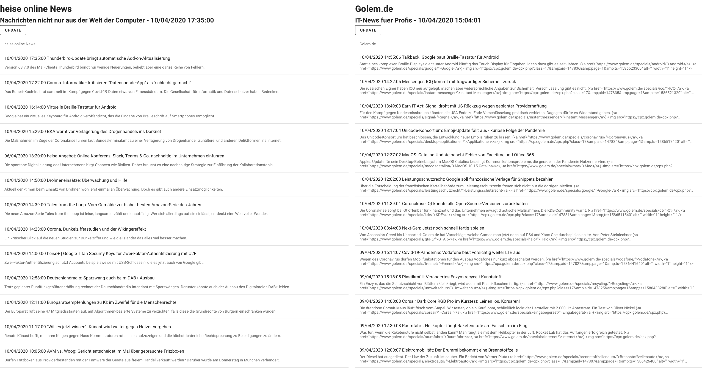

# NEWS-READER

This simple SPA will fetch `atom`-Websources and display them in a list.



## Project setup
```
npm install
```

### Compiles and hot-reloads for development
```
npm run serve
```

### Compiles and minifies for production
```
npm run build
```